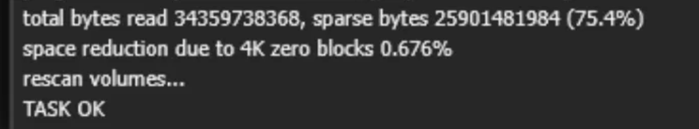
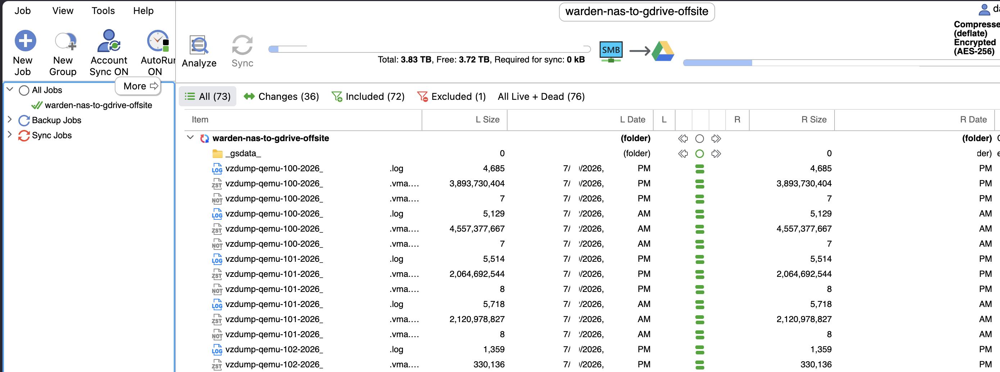
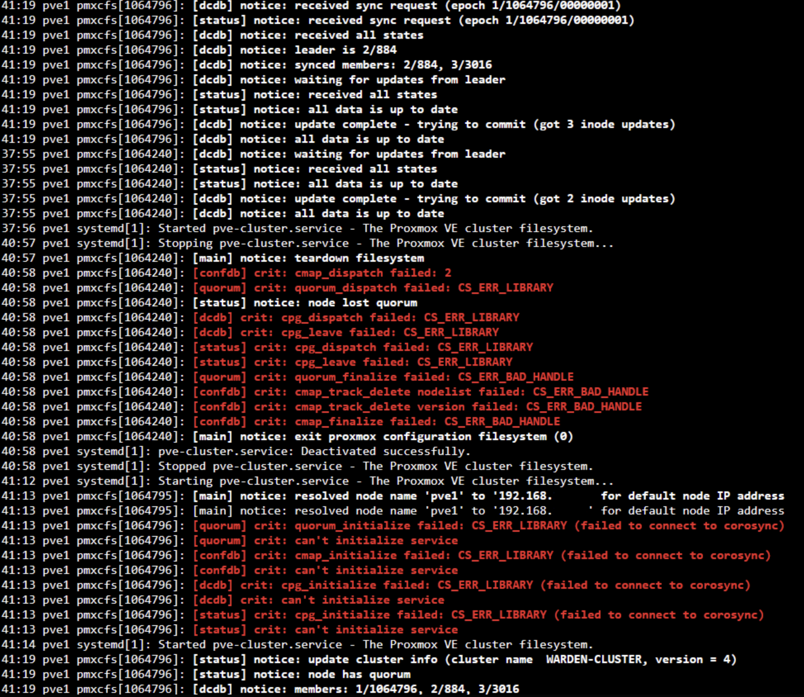
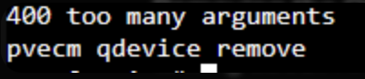
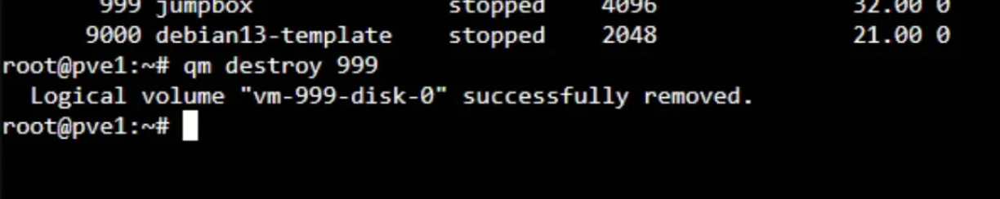

# 🛡️ Phase 8 — Cluster Recovery & 3-2-1 Backup

**Recovering a broken Proxmox cluster, rebuilding after data loss, and building an automated, restore-tested backup system so it never happens again.**

---

> [!NOTE]
> **The short version:** While adding a QDevice in Phase 8, I couldn't cluster all the nodes together — and because I had no backups, the only workaround was reinstalling every node. That cost me **months of work**. This phase is the story of the rebuild, and the backup system I built so a single failure can never wipe out my work again.

### 📊 At a Glance

| | |
|---|---|
| **Goal** | Recover the cluster, then make data loss impossible to repeat |
| **Root cause of the loss** | Destructive cluster changes with zero backups |
| **The fix** | A full 3-2-1 backup strategy — automated and restore-tested |
| **Result** | ✅ Both backup legs automated · restore proven end-to-end · Phase 8 closed |

---

## 📑 Contents

- [What Went Well](#-what-went-well)
- [Challenges I Faced](#-challenges-i-faced)
- [Key Learnings](#-key-learnings)
- [Improvements I Made](#-improvements-i-made)
- [Technical Skills Demonstrated](#-technical-skills-demonstrated)
- [My 3-2-1 Implementation](#-my-3-2-1-implementation)
- [Appendix — The 3-2-1 Backup Rule](#-appendix--the-3-2-1-backup-rule)

---

## ✅ What Went Well

- Recovered a broken multi-node cluster from a cascading failure state by cleaning leftover corosync/pmxcfs config, rebuilding quorum, and rejoining nodes one at a time
- Built and hardened a Synology DS224+ NAS (`warden-nas`) as a dedicated backup target — 2×4TB SHR + Btrfs with data checksums, TOTP 2FA, and default admin/guest accounts disabled
- Configured cluster-wide NFS backup storage in Proxmox (scoped to `10.10.10.0/24` with root-squash on a static IP)
- Ran a successful verification backup (32GB VM → 3.59GB archive at ~174 MB/s, `TASK OK`)
- Automated both backup legs: scheduled Proxmox vzdump (all VMs, Mon/Thu 01:00, 7 daily / 4 weekly / 3 monthly retention) plus off-site GoodSync replication to Google Drive with AES-256 client-side encryption
- Closed the phase properly with a full restore test — proved the backup end-to-end rather than just configuring it

 
<i>Verification backup: 32GB VM → 3.59GB archive at ~174 MB/s, <code>TASK OK</code>.</i>

 
<i>Scheduled cluster-wide backup job — Mon/Thu 01:00, 7/4/3 retention.</i>

---

## ⚠️ Challenges I Faced

> [!WARNING]
> **The core setback:** while adding a QDevice, I couldn't cluster all the nodes together — and with no backups, the only workaround was reinstalling every node. I lost months of work and redid the entire project from scratch. The rebuild alone took weeks.

**🧵 The full cluster error chain I worked through**

| # | Error | Fix |
|---|---|---|
| 1 | **Join failure on pve4** — `authkey already exists`, `corosync.conf already exists`, `corosync already running` | Destroy leftover VMs and wipe old cluster files before `pvecm add` |
| 2 | **Connection refused** — `ipcc_send_rec failed`, `Unable to load access control list` | Restart `pve-cluster`; verify ping, `/etc/hosts`, and time-sync |
| 3 | **Lost quorum** — `quorum_initialize failed: CS_ERR_LIBRARY`, `cpg_initialize failed` | Clean `/var/lib/corosync/*`, restart services, reboot, recheck `pvecm status` |
| 4 | **`pvecm destroy` doesn't exist** | Tear down manually and recreate with `pvecm create` |
| 5 | **`/etc/pve` locked** — `Operation not permitted`, `File exists` | Stuck pmxcfs mount; kill `pmxcfs`, force-unmount, rebuild the directory |
| 6 | **QDevice remove "too many arguments"** | Supply the IP: `pvecm qdevice remove <ip>` |
| 7 | **401 Unauthorized in the Web UI** after the clean | `systemctl restart pveproxy pve-cluster` |
| 8 | **All VMs gone** after resetting `/etc/pve`, no vzdump backups | The moment that forced the full rebuild |

 
<i>Cluster join and quorum failures during recovery.</i>

 
<i>400 too many arguments — resolved by <code>pvecm qdevice remove 192.X.X.X</code>.</i>

**🔧 Off-site backup (GoodSync) troubleshooting**

- GoodSync's initial sync failed with a short-write error (`written less than requested for /tmp/gst_*.tmp`) — the Synology `/tmp` is a small 877MB RAM-backed tmpfs, too small to stage a 3.85GB archive under "Compress and Encrypt" mode
- A systemd drop-in `TMPDIR` override didn't work — GoodSync ignored it
- Old-mode encrypted `.gszip` debris left in the cloud target blocked clean re-syncs

 
<i>GoodSync short-write error — <code>/tmp</code> tmpfs too small to stage the archive.</i>

---

## 💡 Key Learnings

> [!IMPORTANT]
> **Always take a backup before any destructive change.** This single habit would have saved me months — everything else in this phase flows from it.

- A backup is only as good as your last successful restore test — untested backups are a false sense of security
- Never run destructive cluster operations (wiping `/etc/pve`, `/var/lib/corosync`) without confirming VM disks or vzdumps exist first
- Synology `/tmp` is a small tmpfs; any tool that stages large files there will fail — prefer streaming modes over staging
- Don't compress already-compressed archives (Zstd vzdumps) — cost with no benefit
- Replicate only the `dump` subfolder, not the parent — otherwise you sync `#recycle` junk off-site and waste cloud space
- The 3-2-1 rule is the baseline; interviews often extend it to **3-2-1-1-0** (immutable + verified) and probe **RPO/RTO** and full/incremental/differential backup types

---

## 🔨 Improvements I Made

- Adopted the 3-2-1 rule as a standard so a single failure can never wipe out months of work again — chose it because I had the resources on hand (NAS + cloud) to implement all three legs properly
- Now research and plan first, then execute — no destructive commands without a verified backup and a known recovery path
- Fixed the sync at the root cause by switching to "Encrypt File Bodies and Names" mode, which streams instead of staging — also eliminated the pointless double-compression
- Reset the cloud target cleanly by clearing it and running Delete State Files → Sync Complete, 0 errors at 22.65 MB/s
- Validate every backup with a real restore drill (restored jump box → VM 999 on a fresh VMID, network disconnected to avoid an IP conflict, booted, confirmed shell access and correct user identity, then destroyed the test VM)

 
<i>Off-site sync complete — 0 errors at 22.65 MB/s.</i>

 
<i>Restore test — VM 999 booted from backup with confirmed shell access, then destroyed.</i>

---

## 🧰 Technical Skills Demonstrated

| Area | Details |
|---|---|
| **Cluster admin & DR** | Corosync/quorum recovery, pmxcfs mount repair, node rejoin, QDevice management |
| **Linux troubleshooting** | Service restarts, stuck mounts, tmpfs limits, short-write diagnosis, systemd drop-ins |
| **Proxmox backups** | vzdump, NFS storage, retention policies, restore testing |
| **NAS setup & hardening** | Synology SHR/Btrfs, checksums, NFS with root-squash, 2FA |
| **Off-site replication** | Client-side AES-256 encryption (GoodSync → Google Drive) |
| **DR design & validation** | 3-2-1 strategy, restore drills |

---

## 🗂️ My 3-2-1 Implementation

| Leg | Where | Details |
|---|---|---|
| **Copy 1 — primary** | Proxmox cluster | Live VMs on cluster storage |
| **Copy 2 — on-site backup** | Synology DS224+ (`warden-nas`) | Automated vzdump over NFS, 7/4/3 retention |
| **Copy 3 — off-site** | Google Drive via GoodSync | AES-256 client-side encryption, Mon/Thu 01:00 |

> [!TIP]
> All three legs automated. Restore-tested end-to-end. ✅

---

## 📚 Appendix — The 3-2-1 Backup Rule

**3 copies · 2 media types · 1 off-site.**

| Component | Meaning | Why |
|---|---|---|
| **3 copies of data** | 1 primary (production) copy + 2 backup copies | Redundancy — if one copy is lost or corrupted, you still have others |
| **2 different media types** | e.g. internal SSD + external drive, or NAS + cloud | Protects against a failure specific to one storage type (e.g. a whole disk batch failing) |
| **1 copy off-site** | A different physical location, or offline / air-gapped | Protects against site-wide disasters (fire, flood, theft) and ransomware that can reach connected backups |

**Modern extensions**

- **3-2-1-1-0** — adds 1 immutable/air-gapped copy (can't be altered or deleted) and 0 errors (backups regularly tested and verified)
- **3-2-2** — two off-site copies for extra resilience

**Related concepts:** RPO (Recovery Point Objective — acceptable data loss), RTO (Recovery Time Objective — acceptable downtime), backup types (full / incremental / differential), and immutable backups (a key ransomware defense).

> [!IMPORTANT]
> **The one line to remember:** A backup is only as good as your last successful restore test.

---

Part of <b>Project Warden</b> — a home-lab security & infrastructure build. Phase 8 of the roadmap.

